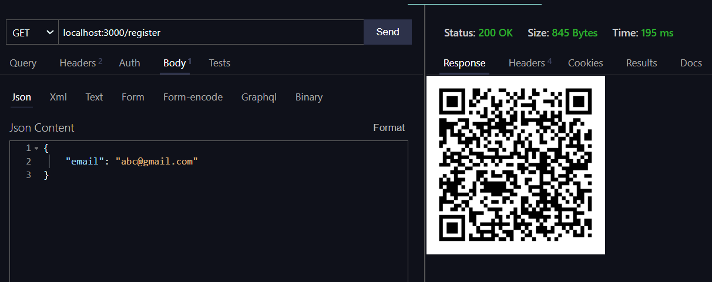
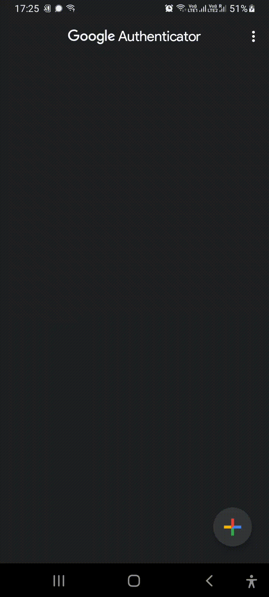

 <h1>TOTP-server</h1>

This project implements a basic Time Based Authentication system implemented in Rust which can be deployed on aws-lambda or can be operated on native system as well

to start the server
`~$ cargo run ` 

to test the code 
`~$ cargo test` 

---

## For sending a fresh request   

`~$ curl -X GET http://localhost:3000/register -v `

response produced contains a QR code which you can scan in your 2FA app to verify

&nbsp;
&nbsp;

   
  &nbsp;
  &nbsp;
  &nbsp;
  &nbsp;
  &nbsp;
  &nbsp;
  &nbsp;
  <ol align = "center">
    <h2>
       
       
       
      <li>open the 2FA app (google authenticator)</li>
      <li>scan the QR generated in the response</li>
      <li>Accept the account generated</li>
      <li>now you can enter the code in 30 second interval</li>
    </h2>
  </ol>

